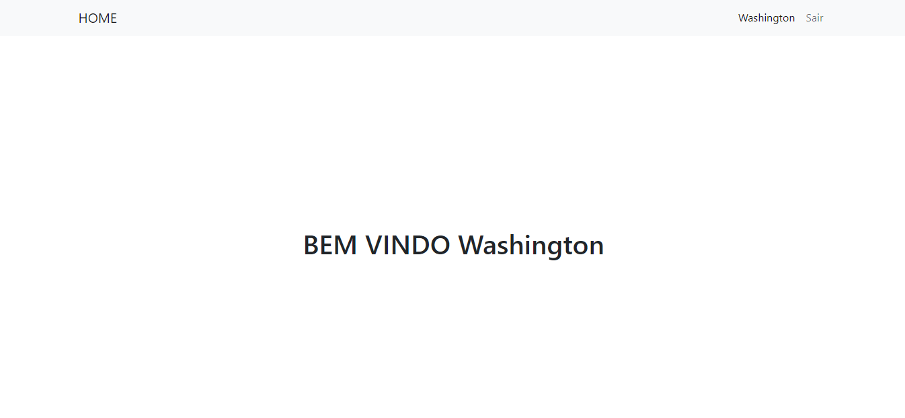

# SISTEMA DE LOGIN PHP

Cadastro e Login em PHP utilizando PDO.

# TELA DE LOGIN

# TELA DE CADASTRO

# HOME PAGE

# TABELA UTILIZADA MYSQL
create database usuario;

create table usuarios(
    id integer primary key AUTO_INCREMENT,
    nome varchar(255) not null,
    email varchar(255) not null,
    senha varchar(225) not null
);
