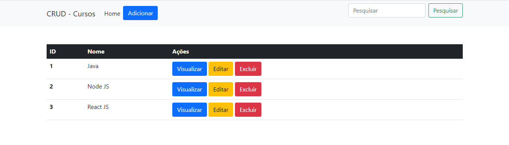

# CRUD Utilizando PHP + MySql + Bootstrap 5

CRUD em PHP com Bootstrap utilizando janela Modal para todas as Funcionalidades, com função de Buscar incluida.



# TABELA UTILIZADA MYSQL
```sql
create database cursos;

create table cursos(
    id integer primary key AUTO_INCREMENT,
    nome varchar(255) not null,
    descricao varchar(255) not null
);
```
